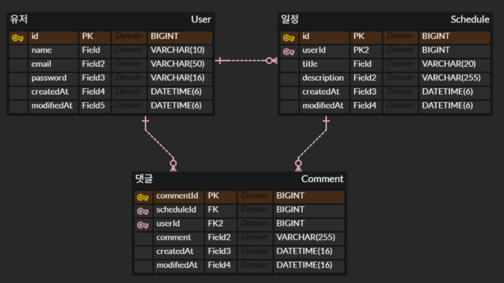
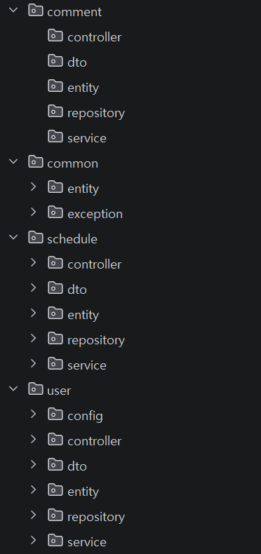

# 일정 관리 앱 Develop  

## 프로젝트 설명
스프링을 사용해 일정, 유저 CRUD, 로그인 구현  
의존성: Lombok, spring Web, mySQL driver, spring data JPA

## ERD


## API 명세서
일정과 유저 CRUD, 로그인 API
## POST 일정 생성

POST /schedules

일정을 생성합니다.

### Request Header
| **이름** | **데이터 타입** | **설명** |
|--------|------------|--------|
| Cookie | JSESSIONID | 세션 키   |

### Request Body

| **이름**      | **데이터 타입** | **설명** |
|-------------|------------|--------|
| title       | String     | 일정 이름  |
| description | String     | 일정 내용  |


### Response Body

| **이름**      | **데이터 타입**    | **설명**                               |
|-------------|---------------|--------------------------------------|
| id          | Long          | 일정 식별 id, 응답 시 반환                    |
| userId      | Long          | 로그인한 유저 id                           |
| title       | String        | 일정 이름                                |
| description | String        | 일정 내용                                |
| createdAt   | LocalDateTime | 작성일, 자동으로 현재 날짜 저장됨                  |
| modifiedAt  | LocalDateTime | 수정일, 자동으로 현재 날짜 저장됨(처음 생성 시 작성일과 동일) |

> Body Parameters

```json
{
  "title": "Study",
  "description": "Spring"
}
```

> Response Examples

> 201 Response

```json
{
  "id": 1,
  "userId": 1,
  "title": "Study",
  "description": "Spring",
  "createdAt": "2025-04-09T14:30:00.123456",
  "modifiedAt": "2025-04-09T14:30:00.123456"
}
```

> 401 Response
```text
"로그인이 필요합니다"
```

## GET 일정 전체 조회

GET /schedules

전체 일정 배열을 조회합니다.

### Request Header
| **이름** | **데이터 타입** | **설명** |
|--------|------------|--------|
| Cookie | JSESSIONID | 세션 키   |


### ResponseBody

| **이름** | **데이터 타입** | **설명**            |
|--------|------------|-------------------|
| id     | Long       | 일정 식별 id, 응답 시 반환 |
| userId | Long       | 로그인한 유저 id        |
| title  | String     | 일정 이름             |


> Response Examples

> 200 Response

```json
[
  {
    "id": 1,
    "userId": 1,
    "title": "Study"
  },
  {
    "id": 2,
    "userId": 1,
    "title": "Study"
  }
]
```

## GET 일정 선택 조회

선택한 일정을 조회합니다.

GET /schedules/{id}

### Request Header
| **이름** | **데이터 타입** | **설명** |
|--------|------------|--------|
| Cookie | JSESSIONID | 세션 키   |

### Response Body

| **이름**      | **데이터 타입**    | **설명**            |
|-------------|---------------|-------------------|
| id          | Long          | 일정 식별 id, 응답 시 반환 |
| userId      | Long          | 로그인한 유저 id        |
| title       | String        | 일정 이름             |
| description | String        | 일정 내용             |
| createdAt   | LocalDateTime | 작성일               |
| modifiedAt  | LocalDateTime | 수정일               |
| comments    | List          | 해당 일정 댓글 배열       |

> Response Examples

> 200 Response

```json
{
  "id": 2,
  "userId": 1,
  "title": "Study",
  "description": "API",
  "createdAt": "2025-04-09T14:35:00.123456",
  "modifiedAt": "2025-04-09T14:35:00.123456",
  "comments": [
    {
      "commentId": 1,
      "scheduleId": 2,
      "comment": "댓글 남기기",
      "createdAt": "2025-04-09T14:30:00.123456",
      "modifiedAt": "2025-04-09T14:30:00.123456"
    },
    {
      "commentId": 2,
      "scheduleId": 2,
      "comment": "댓글 남기기222",
      "createdAt": "2025-04-09T14:30:00.123456",
      "modifiedAt": "2025-04-09T14:30:00.123456"
    }
  ]
}
```

## PATCH 일정 수정

선택한 일정의 일정 이름과 내용을 수정할 수 있습니다.

PUT /schedules/{id}

### Request Header
| **이름** | **데이터 타입** | **설명** |
|--------|------------|--------|
| Cookie | JSESSIONID | 세션 키   |

### RequestBody

| **이름**     | **데이터 타입** | **설명** |
|------------|------------|--------|
| title      | String     | 일정 이름  |
| desciption | String     | 일정 내용  |

### ResponseBody

| **이름**      | **데이터 타입**    | **설명**            |
|-------------|---------------|-------------------|
| id          | Long          | 일정 식별 id, 응답 시 반환 |
| title       | String        | 일정 이름             |
| description | String        | 일정 내용             |
| modifiedAt  | LocalDateTime | 수정일               |

> Body Parameters

```json
{
  "title": "일정이름 변경",
  "description": "일정내용 변경"
}
```

> Response Examples

> 200 Response

```json
{
  "id": 1,
  "title": "일정이름 변경",
  "description": "일정내용 변경",
  "modifiedAt": "2025-04-09T15:35:00.654321"
}
```


## DELETE 일정 삭제

선택한 일정을 삭제합니다.

DELETE /schedules/{id}

### Request Header
| **이름** | **데이터 타입** | **설명** |
|--------|------------|--------|
| Cookie | JSESSIONID | 세션 키   |


> Response Examples

> 204 Response
```text
"삭제되었습니다"
```

## POST 유저 생성, 회원가입

POST /users

유저를 생성합니다.

### Request Body

| **이름**   | **데이터 타입** | **설명** |
|----------|------------|--------|
| name     | String     | 유저 이름  |
| email    | String     | 이메일    |
| password | String     | 비밀번호   |


### Response Body

| **이름**     | **데이터 타입**    | **설명**                               |
|------------|---------------|--------------------------------------|
| id         | Long          | 유저 식별 id                             |
| name       | String        | 유저 이름                                |
| email      | String        | 이메일                                  |
| createdAt  | LocalDateTime | 작성일, 자동으로 현재 날짜 저장됨                  |
| modifiedAt | LocalDateTime | 수정일, 자동으로 현재 날짜 저장됨(처음 생성 시 작성일과 동일) |

> Body Parameters

```json
{
  "name": "Kim",
  "email": "kim@naver.com"
}
```

> Response Examples

> 201 Response

```json
{
  "id": 1,
  "name": "Kim",
  "email": "kim@naver.com",
  "createdAt": "2025-04-09T14:30:00.123456",
  "modifiedAt": "2025-04-09T14:30:00.123456"
}
```

## GET 유저 전체 조회

GET /users

전체 유저 배열을 조회합니다.

### ResponseBody

| **이름**     | **데이터 타입**    | **설명**                               |
|------------|---------------|--------------------------------------|
| id         | Long          | 유저 식별 id                             |
| name       | String        | 유저 이름                                |
| email      | String        | 이메일                                  |
| createdAt  | LocalDateTime | 작성일, 자동으로 현재 날짜 저장됨                  |
| modifiedAt | LocalDateTime | 수정일, 자동으로 현재 날짜 저장됨(처음 생성 시 작성일과 동일) |

> Response Examples

> 200 Response

```json
[
  {
    "id": 1,
    "name": "Kim",
    "email": "kim@naver.com",
    "createdAt": "2025-04-09T14:30:00.123456",
    "modifiedAt": "2025-04-09T14:30:00.123456"
  },
  {
    "id": 2,
    "name": "Na",
    "email": "na@naver.com",
    "createdAt": "2025-04-09T14:30:00.123456",
    "modifiedAt": "2025-04-09T14:30:00.123456"
  }
]
```

## GET 유저 선택 조회

선택한 유저를 조회합니다.

GET /users/{id}


### Response Body

| **이름**     | **데이터 타입**    | **설명**                               |
|------------|---------------|--------------------------------------|
| id         | Long          | 유저 식별 id                             |
| name       | String        | 유저 이름                                |
| email      | String        | 이메일                                  |
| createdAt  | LocalDateTime | 작성일, 자동으로 현재 날짜 저장됨                  |
| modifiedAt | LocalDateTime | 수정일, 자동으로 현재 날짜 저장됨(처음 생성 시 작성일과 동일) |


> Response Examples

> 200 Response

```json
{
  "id": 2,
  "name": "Na",
  "email": "na@naver.com",
  "createdAt": "2025-04-09T14:30:00.123456",
  "modifiedAt": "2025-04-09T14:30:00.123456"
}
```

## PATCH 유저 수정

선택한 유저의 유저 이름을 수정할 수 있습니다.

PUT /users/{id}


### RequestBody

| **이름** | **데이터 타입** | **설명** |
|--------|------------|--------|
| name   | String     | 유저 이름  |

### ResponseBody

| **이름**     | **데이터 타입**    | **설명**   |
|------------|---------------|----------|
| id         | Long          | 유저 식별 id |
| name       | String        | 유저 이름    |
| modifiedAt | LocalDateTime | 수정일      |

> Body Parameters

```json
{
  "name": "유저 이름 변경"
}
```

> Response Examples

> 200 Response

```json
{
  "id": 1,
  "name": "유저 이름 변경",
  "modifiedAt": "2025-04-09T15:35:00.654321"
}
```


## DELETE 유저 삭제

선택한 유저를 삭제합니다.

DELETE /users/{id}

> Response Examples

> 204 Response
```text
"삭제되었습니다"
```

## POST 로그인
이메일과 비밀번호를 입력하여 로그인합니다.

POST /login

### RequestBody

| **이름**   | **데이터 타입** | **설명** |
|----------|------------|--------|
| email    | String     | 이메일    |
| password | String     | 비밀번호   |

### ResponseHeader
| **이름**     | **데이터 타입** | **설명** |
|------------|------------|--------|
| Set-Cookie | JSESSIONID | 세션 키   |

> Response Examples

> 200 Response
```text
"로그인되었습니다"
```

> 400 Response
```text
"비밀번호 오류"
```

## POST 댓글 생성

POST /schedules/{scheduleId}/comments

일정에 댓글을 생성합니다.

### Request Header
| **이름** | **데이터 타입** | **설명** |
|--------|------------|--------|
| Cookie | JSESSIONID | 세션 키   |

### Request Body

| **이름**     | **데이터 타입** | **설명**    |
|------------|------------|-----------|
| comment    | String     | 댓글 내용     |


### Response Body

| **이름**     | **데이터 타입**    | **설명**                               |
|------------|---------------|--------------------------------------|
| commentId  | Long          | 댓글 식별 id                             |
| scheduleId | Long          | 일정 식별 id                             |
| comment    | String        | 댓글 내용                                |
| createdAt  | LocalDateTime | 작성일, 자동으로 현재 날짜 저장됨                  |
| modifiedAt | LocalDateTime | 수정일, 자동으로 현재 날짜 저장됨(처음 생성 시 작성일과 동일) |

> Body Parameters

```json
{
  "comment": "댓글 남기기"
}
```

> Response Examples

> 201 Response

```json
{
  "commentId": 1,
  "scheduleId": 1,
  "comment": "댓글 남기기",
  "createdAt": "2025-04-09T14:30:00.123456",
  "modifiedAt": "2025-04-09T14:30:00.123456"
}
```

## GET 댓글 전체 조회

GET /schedules/comments

전체 댓글 배열을 조회합니다.

### Request Header
| **이름** | **데이터 타입** | **설명** |
|--------|------------|--------|
| Cookie | JSESSIONID | 세션 키   |

### ResponseBody

| **이름**     | **데이터 타입** | **설명**   |
|------------|------------|----------|
| commentId  | Long       | 댓글 식별 id |
| scheduleId | Long       | 일정 식별 id |
| comment    | String     | 댓글 내용    |

> Response Examples

> 200 Response

```json
[
  {
    "commentId": 1,
    "scheduleId": 1,
    "comment": "댓글 남기기"
  },
  {
    "commentId": 2,
    "scheduleId": 1,
    "comment": "댓글 남기기222"
  }
]
```

## 프로젝트 구조

